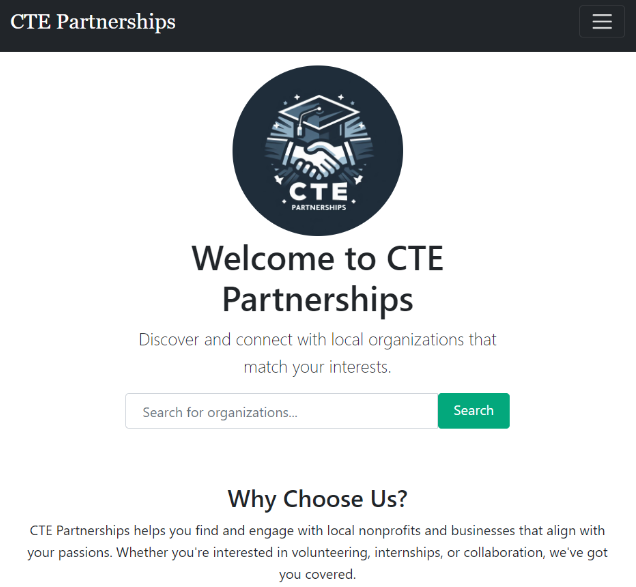
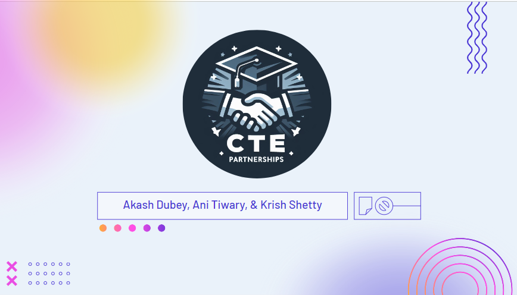
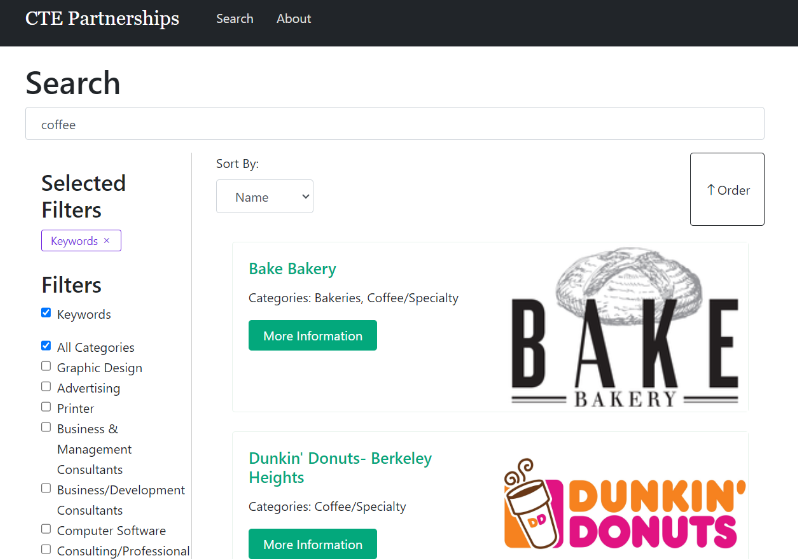
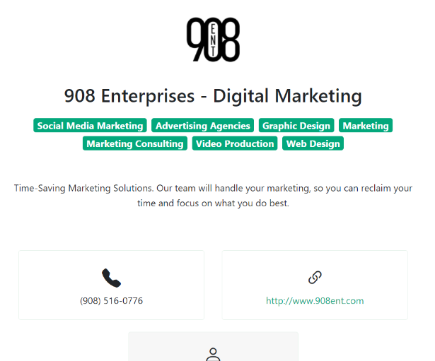
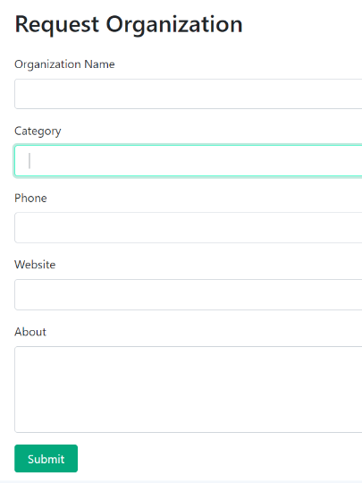
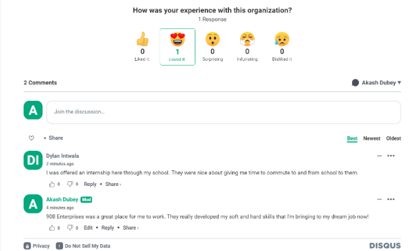

# CTE Partnerships

Akash Dubey, Ani Tiwary, and Krish Shettys' submission for FBLA's Coding and Programming Event 2024. We placed in the top 10 at the State Leadership Conference.

Presentation

## Purpose

### Prompt

Create a program that allows your school’s Career and Technical Education Department to collect and store information about business and community partners. This program should include information on at least 25 different partners (real or fictional), with details such as, but not limited to, the type of organization, resources available, and direct contact information for an individual. The program should enable users to search and filter the information as needed.

[Source](https://connect.fbla.org/headquarters/files/High%20School%20Competitive%20Events%20Resources/Individual%20Guidelines/Presentation%20Events/Coding--Programming.pdf)

[Rubric](https://www.fbla.org/media/Coding-and-Programming-FBLA-Rating-Sheet-2.pdf)

### Our Goal

We wanted to combine all the sources of information about community partners into a single, easy-to-use location that updates automatically with new data.

## Process

We gathered data through web scraping and developed a web app to manage it. We also collected feedback to improve our solution.

- **Collecting Data:** Obtained information from online sources, extracted relevant information, and structured it using JSON format.
- **Feedback:** Collected feedback indicating the application was helpful in searching for internship/job opportunities, though some users experienced difficulties in finding specific internships.

## Features

### Search for Businesses
Use filters, keywords, and sorting to find the information you need.

### View Information about Businesses
For each business, you can see industry information, contact details, and detailed description.

### Add Organizations
If organizations can't be scrapped from other sites online, they can also be added manually through a form.

### Comments
Using Disqus, users can leave comments on the website to provide feedback or ask questions about organizations.

## Functionality

- **Web Scraping:** We used web scraping techniques to collect data from local websites about various businesses and community partners. This automated process ensures that the information is up-to-date and comprehensive, providing the CTE department with all the data they need in one place.
- **Data Storage:** The collected data is stored in a structured JSON format, making it easy to access and manipulate within our application.
- **Search and Filter:** The app includes robust search and filter functionalities, allowing users to quickly find specific information based on keywords or categories.
- **User Interface:** The user-friendly interface allows users to add new organizations, view detailed information about partners, and leave comments.

## Software Used

- **React:** We used React to build the front end of our application, providing a responsive and interactive user experience.
- **Node.js:** Our backend is powered by Node.js, handling data processing and server-side logic.
- **Express:** We used Express to set up our server and manage API endpoints.
- **Cheerio:** For web scraping, we used Cheerio to parse HTML and extract relevant data from local websites.
- **GitHub:** Version control and collaboration were managed through GitHub, ensuring efficient team coordination and code management.

## Benefits of a Web-Based Approach

Creating a web-based application makes it easier for both the CTE department and students to access the data. The centralized platform allows for real-time updates and accessibility from any device with an internet connection. This ensures that everyone has the most current information and can make informed decisions regarding partnerships and opportunities.

## Development

In the project directory, you can run:

### `npm start`

Runs the app in development mode.\
Open [http://localhost:3000](http://localhost:3000) to view it in your browser. The page will reload when you make changes. You may also see any lint errors in the console.

### `npm test`

Launches the test runner in the interactive watch mode.\
See the section about [running tests](https://facebook.github.io/create-react-app/docs/running-tests) for more information.

### `npm run build`

Builds the app for production to the `build` folder.\
It correctly bundles React in production mode and optimizes the build for the best performance. The build is minified and the filenames include the hashes. Your app is ready to be deployed!

See the section about [deployment](https://facebook.github.io/create-react-app/docs/deployment) for more information.

### `npm run eject`

**Note: this is a one-way operation. Once you `eject`, you can't go back!**

If you aren't satisfied with the build tool and configuration choices, you can `eject` at any time. This command will remove the single build dependency from your project.

Instead, it will copy all the configuration files and transitive dependencies (webpack, Babel, ESLint, etc) right into your project so you have full control over them. All of the commands except `eject` will still work, but they will point to the copied scripts so you can tweak them. At this point you're on your own.

You don't have to ever use `eject`. The curated feature set is suitable for small and middle deployments, and you shouldn't feel obligated to use this feature. However, we understand that this tool wouldn't be useful if you couldn't customize it when you are ready for it.

## Learn More

You can learn more in the [Create React App documentation](https://facebook.github.io/create-react-app/docs/getting-started).

To learn React, check out the [React documentation](https://reactjs.org/).

## Additional Information

Check out the live project [here](https://fbla-website-app.vercel.app/) and the source code on GitHub [here](https://github.com/AkeBoss-tech/fbla-website-app).
